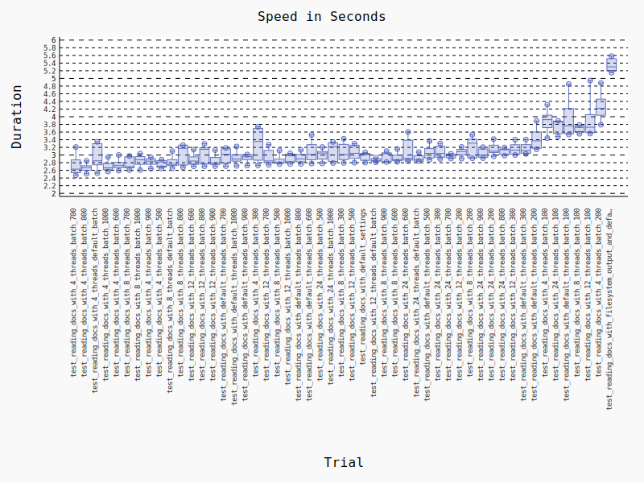

```text
======================================================================================================================== test session starts =========================================================================================================================
platform linux -- Python 3.9.19, pytest-7.4.4, pluggy-1.5.0
benchmark: 4.0.0 (defaults: timer=time.perf_counter disable_gc=False min_rounds=5 min_time=0.000005 max_time=1.0 calibration_precision=10 warmup=False warmup_iterations=100000)
rootdir: /home/tom/workspace/projects/mlclient
configfile: pyproject.toml
plugins: mock-3.14.0, bdd-7.2.0, cov-4.1.0, benchmark-4.0.0, asyncio-0.23.8
asyncio: mode=strict
collected 51 items                                                                                                                                                                                                                                                   

tests/performance/mlclient/jobs/test_read_documents_job.py ...................................................                                                                                                                                                 [100%]
Saved benchmark data in: /home/tom/workspace/projects/mlclient/.benchmarks/Linux-CPython-3.9-64bit/0006_8d5eaa19ad4733273ceab0b24f7ee569a6569b68_20240814_073941_uncommited-changes.json


--------------------------------------------------------------------------------------------------- benchmark: 51 tests ----------------------------------------------------------------------------------------------------
Name (time in s)                                                     Min               Max              Mean            StdDev            Median               IQR            Outliers     OPS            Rounds  Iterations
----------------------------------------------------------------------------------------------------------------------------------------------------------------------------------------------------------------------------
test_reading_docs_with_4_threads_batch_700                        2.4722 (1.0)      3.2097 (1.13)     2.7277 (1.02)     0.2894 (6.33)     2.6322 (1.0)      0.3331 (5.01)          1;0  0.3666 (0.98)          5           1
test_reading_docs_with_4_threads_batch_800                        2.5110 (1.02)     2.8482 (1.0)      2.6688 (1.0)      0.1209 (2.65)     2.6716 (1.01)     0.1186 (1.78)          2;0  0.3747 (1.0)           5           1
test_reading_docs_with_4_threads_default_batch                    2.5249 (1.02)     3.3464 (1.17)     2.9634 (1.11)     0.3435 (7.52)     2.8496 (1.08)     0.5502 (8.27)          2;0  0.3374 (0.90)          5           1
test_reading_docs_with_4_threads_batch_1000                       2.5701 (1.04)     2.9491 (1.04)     2.7077 (1.01)     0.1456 (3.19)     2.6650 (1.01)     0.1615 (2.43)          1;0  0.3693 (0.99)          5           1
test_reading_docs_with_4_threads_batch_600                        2.5930 (1.05)     3.0009 (1.05)     2.7510 (1.03)     0.1512 (3.31)     2.7250 (1.04)     0.1383 (2.08)          2;0  0.3635 (0.97)          5           1
test_reading_docs_with_8_threads_batch_700                        2.6082 (1.06)     2.9767 (1.05)     2.7822 (1.04)     0.1673 (3.66)     2.6965 (1.02)     0.2887 (4.34)          2;0  0.3594 (0.96)          5           1
test_reading_docs_with_8_threads_batch_1000                       2.6083 (1.06)     3.0386 (1.07)     2.8528 (1.07)     0.1608 (3.52)     2.8748 (1.09)     0.2019 (3.03)          2;0  0.3505 (0.94)          5           1
test_reading_docs_with_4_threads_batch_900                        2.6466 (1.07)     2.9408 (1.03)     2.8228 (1.06)     0.1122 (2.45)     2.8406 (1.08)     0.1426 (2.14)          2;0  0.3543 (0.95)          5           1
test_reading_docs_with_4_threads_batch_500                        2.6547 (1.07)     2.8812 (1.01)     2.7561 (1.03)     0.1016 (2.22)     2.7078 (1.03)     0.1764 (2.65)          1;0  0.3628 (0.97)          5           1
test_reading_docs_with_8_threads_default_batch                    2.6579 (1.08)     3.1012 (1.09)     2.8148 (1.05)     0.1692 (3.70)     2.7577 (1.05)     0.1582 (2.38)          1;0  0.3553 (0.95)          5           1
test_reading_docs_with_8_threads_batch_800                        2.6816 (1.08)     3.2599 (1.14)     3.0265 (1.13)     0.2833 (6.20)     3.1759 (1.21)     0.5189 (7.80)          1;0  0.3304 (0.88)          5           1
test_reading_docs_with_12_threads_batch_600                       2.7053 (1.09)     3.1421 (1.10)     2.8712 (1.08)     0.1667 (3.65)     2.8431 (1.08)     0.1946 (2.92)          1;0  0.3483 (0.93)          5           1
test_reading_docs_with_12_threads_batch_800                       2.7076 (1.10)     3.2937 (1.16)     3.0181 (1.13)     0.2557 (5.59)     3.1500 (1.20)     0.4211 (6.33)          2;0  0.3313 (0.88)          5           1
test_reading_docs_with_12_threads_batch_900                       2.7094 (1.10)     3.1284 (1.10)     2.8544 (1.07)     0.1644 (3.60)     2.7884 (1.06)     0.1840 (2.76)          1;0  0.3503 (0.93)          5           1
test_reading_docs_with_default_threads_batch_700                  2.7108 (1.10)     3.1861 (1.12)     2.9770 (1.12)     0.2094 (4.58)     3.0195 (1.15)     0.3763 (5.65)          1;0  0.3359 (0.90)          5           1
test_reading_docs_with_default_threads_batch_1000                 2.7168 (1.10)     3.2240 (1.13)     2.9324 (1.10)     0.1839 (4.02)     2.8975 (1.10)     0.1705 (2.56)          2;0  0.3410 (0.91)          5           1
test_reading_docs_with_default_threads_batch_900                  2.7269 (1.10)     3.0146 (1.06)     2.9276 (1.10)     0.1180 (2.58)     2.9530 (1.12)     0.1333 (2.00)          1;0  0.3416 (0.91)          5           1
test_reading_docs_with_4_threads_batch_300                        2.7278 (1.10)     3.7385 (1.31)     3.2837 (1.23)     0.4528 (9.91)     3.3566 (1.28)     0.8322 (12.51)         2;0  0.3045 (0.81)          5           1
test_reading_docs_with_12_threads_batch_700                       2.7419 (1.11)     3.2725 (1.15)     2.9493 (1.11)     0.2182 (4.77)     2.8460 (1.08)     0.3230 (4.85)          1;0  0.3391 (0.90)          5           1
test_reading_docs_with_8_threads_batch_500                        2.7636 (1.12)     3.1176 (1.09)     2.8597 (1.07)     0.1456 (3.19)     2.8054 (1.07)     0.1083 (1.63)          1;1  0.3497 (0.93)          5           1
test_reading_docs_with_12_threads_batch_1000                      2.7670 (1.12)     3.0446 (1.07)     2.9316 (1.10)     0.1195 (2.61)     2.9797 (1.13)     0.1989 (2.99)          1;0  0.3411 (0.91)          5           1
test_reading_docs_with_default_threads_batch_800                  2.7675 (1.12)     3.1345 (1.10)     2.9234 (1.10)     0.1409 (3.08)     2.8973 (1.10)     0.1947 (2.93)          2;0  0.3421 (0.91)          5           1
test_reading_docs_with_default_threads_batch_600                  2.7768 (1.12)     3.5251 (1.24)     3.0831 (1.16)     0.2891 (6.33)     3.0158 (1.15)     0.3946 (5.93)          2;0  0.3243 (0.87)          5           1
test_reading_docs_with_24_threads_batch_500                       2.7795 (1.12)     3.2087 (1.13)     3.0057 (1.13)     0.1606 (3.51)     3.0524 (1.16)     0.2037 (3.06)          2;0  0.3327 (0.89)          5           1
test_reading_docs_with_24_threads_batch_1000                      2.7899 (1.13)     3.3424 (1.17)     3.1028 (1.16)     0.2630 (5.76)     3.2182 (1.22)     0.4853 (7.29)          1;0  0.3223 (0.86)          5           1
test_reading_docs_with_8_threads_batch_300                        2.7938 (1.13)     3.4257 (1.20)     3.0744 (1.15)     0.2536 (5.55)     3.0131 (1.14)     0.3983 (5.99)          2;0  0.3253 (0.87)          5           1
test_reading_docs_with_12_threads_batch_500                       2.7995 (1.13)     3.2969 (1.16)     3.0672 (1.15)     0.2057 (4.50)     3.0455 (1.16)     0.3431 (5.16)          2;0  0.3260 (0.87)          5           1
test_reading_docs_with_default_settings                           2.8045 (1.13)     3.0682 (1.08)     2.9610 (1.11)     0.1127 (2.47)     3.0149 (1.15)     0.1815 (2.73)          1;0  0.3377 (0.90)          5           1
test_reading_docs_with_12_threads_default_batch                   2.8126 (1.14)     2.9280 (1.03)     2.8671 (1.07)     0.0457 (1.0)      2.8486 (1.08)     0.0665 (1.0)           2;0  0.3488 (0.93)          5           1
test_reading_docs_with_8_threads_batch_900                        2.8156 (1.14)     3.1032 (1.09)     2.9658 (1.11)     0.1312 (2.87)     3.0329 (1.15)     0.2272 (3.41)          2;0  0.3372 (0.90)          5           1
test_reading_docs_with_8_threads_batch_600                        2.8239 (1.14)     3.1565 (1.11)     2.9331 (1.10)     0.1323 (2.90)     2.8803 (1.09)     0.1462 (2.20)          1;0  0.3409 (0.91)          5           1
test_reading_docs_with_24_threads_batch_600                       2.8373 (1.15)     3.6024 (1.26)     3.1092 (1.17)     0.3365 (7.36)     2.9118 (1.11)     0.5209 (7.83)          1;0  0.3216 (0.86)          5           1
test_reading_docs_with_24_threads_default_batch                   2.8405 (1.15)     3.0761 (1.08)     2.9189 (1.09)     0.0989 (2.16)     2.8847 (1.10)     0.1418 (2.13)          1;0  0.3426 (0.91)          5           1
test_reading_docs_with_default_threads_batch_500                  2.8802 (1.17)     3.3653 (1.18)     3.0672 (1.15)     0.1889 (4.13)     3.0439 (1.16)     0.2490 (3.74)          1;0  0.3260 (0.87)          5           1
test_reading_docs_with_24_threads_batch_300                       2.9003 (1.17)     3.3023 (1.16)     3.0813 (1.15)     0.1685 (3.69)     3.0413 (1.16)     0.2852 (4.29)          2;0  0.3245 (0.87)          5           1
test_reading_docs_with_24_threads_batch_700                       2.9064 (1.18)     3.0343 (1.07)     2.9766 (1.12)     0.0564 (1.23)     2.9839 (1.13)     0.1022 (1.54)          2;0  0.3360 (0.90)          5           1
test_reading_docs_with_12_threads_batch_200                       2.9087 (1.18)     3.2122 (1.13)     3.0744 (1.15)     0.1126 (2.46)     3.0900 (1.17)     0.1428 (2.15)          2;0  0.3253 (0.87)          5           1
test_reading_docs_with_8_threads_batch_200                        2.9147 (1.18)     3.5294 (1.24)     3.2121 (1.20)     0.2760 (6.04)     3.3098 (1.26)     0.4875 (7.33)          3;0  0.3113 (0.83)          5           1
test_reading_docs_with_24_threads_batch_900                       2.9195 (1.18)     3.2064 (1.13)     3.0441 (1.14)     0.1245 (2.72)     3.0036 (1.14)     0.2160 (3.25)          2;0  0.3285 (0.88)          5           1
test_reading_docs_with_24_threads_batch_200                       2.9654 (1.20)     3.4172 (1.20)     3.1576 (1.18)     0.1682 (3.68)     3.1005 (1.18)     0.1915 (2.88)          2;0  0.3167 (0.85)          5           1
test_reading_docs_with_24_threads_batch_800                       2.9845 (1.21)     3.1984 (1.12)     3.0972 (1.16)     0.0916 (2.00)     3.1404 (1.19)     0.1497 (2.25)          2;0  0.3229 (0.86)          5           1
test_reading_docs_with_12_threads_batch_300                       3.0002 (1.21)     3.4018 (1.19)     3.1567 (1.18)     0.1629 (3.56)     3.1273 (1.19)     0.2463 (3.70)          1;0  0.3168 (0.85)          5           1
test_reading_docs_with_default_threads_batch_300                  3.0301 (1.23)     3.4050 (1.20)     3.1665 (1.19)     0.1538 (3.36)     3.1187 (1.18)     0.2250 (3.38)          1;0  0.3158 (0.84)          5           1
test_reading_docs_with_default_threads_batch_200                  3.1505 (1.27)     3.8903 (1.37)     3.4214 (1.28)     0.2991 (6.54)     3.3719 (1.28)     0.4246 (6.38)          1;0  0.2923 (0.78)          5           1
test_reading_docs_with_4_threads_batch_100                        3.4425 (1.39)     4.3138 (1.51)     3.8871 (1.46)     0.3128 (6.84)     3.9238 (1.49)     0.3247 (4.88)          2;0  0.2573 (0.69)          5           1
test_reading_docs_with_24_threads_batch_100                       3.4832 (1.41)     3.8937 (1.37)     3.7432 (1.40)     0.1930 (4.22)     3.8695 (1.47)     0.3217 (4.84)          1;0  0.2672 (0.71)          5           1
test_reading_docs_with_default_threads_batch_100                  3.5365 (1.43)     4.8515 (1.70)     3.9437 (1.48)     0.5408 (11.83)    3.7629 (1.43)     0.6575 (9.88)          1;0  0.2536 (0.68)          5           1
test_reading_docs_with_8_threads_batch_100                        3.5563 (1.44)     3.7838 (1.33)     3.6908 (1.38)     0.0976 (2.14)     3.7229 (1.41)     0.1645 (2.47)          1;0  0.2709 (0.72)          5           1
test_reading_docs_with_12_threads_batch_100                       3.5613 (1.44)     4.9460 (1.74)     3.9171 (1.47)     0.5811 (12.72)    3.7262 (1.42)     0.4669 (7.02)          1;1  0.2553 (0.68)          5           1
test_reading_docs_with_4_threads_batch_200                        3.7910 (1.53)     4.8817 (1.71)     4.2662 (1.60)     0.3970 (8.69)     4.2172 (1.60)     0.4196 (6.31)          2;0  0.2344 (0.63)          5           1
test_reading_docs_with_filesystem_output_and_default_settings     5.1480 (2.08)     5.5804 (1.96)     5.3476 (2.00)     0.1835 (4.01)     5.3018 (2.01)     0.3161 (4.75)          2;0  0.1870 (0.50)          5           1
----------------------------------------------------------------------------------------------------------------------------------------------------------------------------------------------------------------------------


Generated histogram: /home/tom/workspace/projects/mlclient/benchmark_20240814_073941.svg
Legend:
  Outliers: 1 Standard Deviation from Mean; 1.5 IQR (InterQuartile Range) from 1st Quartile and 3rd Quartile.
  OPS: Operations Per Second, computed as 1 / Mean
================================================================================================================== 51 passed in 1140.06s (0:19:00) ===================================================================================================================
```

